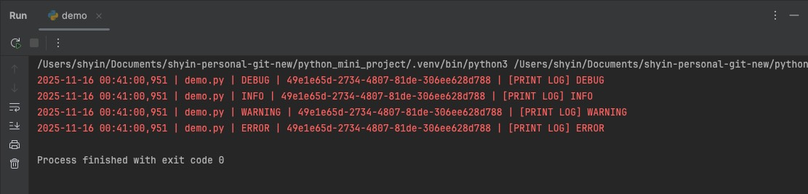

# LoggerLibrary

A simple Python logging utility with console/file output and automatic log cleanup.



## Features

- **Simple setup** - One function call to configure everything
- **Session tracking** - Auto-generated UUID helps trace logs from the same execution
- **Dual output** - Log to console for debugging, file for persistent records
- **Auto cleanup** - Keep only recent logs (default: 3 days), no manual deletion needed

## Quick Start

```python
from logger import setup_logger

# Method1: Customize
logger = setup_logger(
    name=__name__, 
    enable_console=True,
    enable_file=True, 
    level=logging.INFO,
    dir='./logs'
)
logger.debug('Debug message')

# Method2: Default
logger = setup_logger()
logger.debug('Debug message')
```

## Log Format

```
2025-11-16 00:41:00,951 | demo.py | INFO | 49e1e65d-2734-4807-81de-306ee628d788 | Your message
```

## Requirements

- Python 3.x
- Standard library only (no external dependencies)